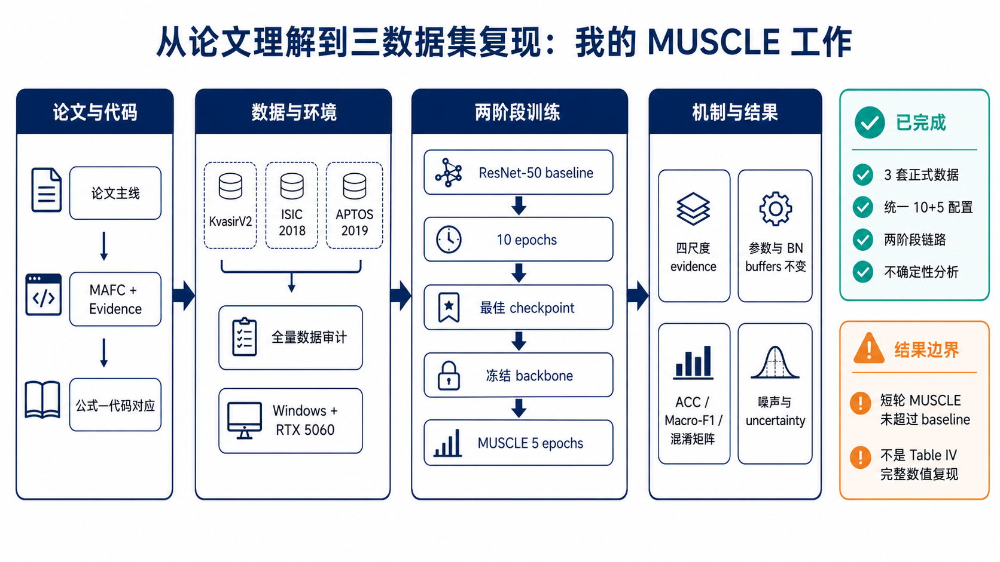

# MUSCLE：三套正式数据集上的 ResNet-50 两阶段复现

本仓库 fork 自 [Q4CS/MUSCLE](https://github.com/Q4CS/MUSCLE)，对应论文 *MUSCLE: A New Perspective to Multi-Scale Fusion for Medical Image Classification Based on the Theory of Evidence*。在保留原作者核心网络、损失函数与数据接口的基础上，本 fork 新增了在 KvasirV2、ISIC 2018 和 APTOS 2019 三套论文数据集上完成了全量数据的 ResNet-50 两阶段短轮复现，区别于上周的仅仅是少轮次的训练。

这里的“复现”指数据审计、baseline 训练、checkpoint 传递、MUSCLE 训练、冻结检查、指标计算和不确定性分析已经形成可重复的完整链路。训练轮数为 baseline 10 epoch、MUSCLE 5 epoch，由于电脑性能限制，训练明显少于论文的 500+200 epoch，故主要目的是用于验证公开方法和代码行为。

## 我的复现工作

## 当前完成情况

三套数据均使用完整训练、验证和测试划分，统一采用 ResNet-50、256×256 输入、随机种子 1234、batch size 16、AMP 和相同的 10+5 epoch 配置。实验环境为 Windows、PyTorch 2.11.0+cu128 和 NVIDIA GeForce RTX 5060 Laptop GPU。

已经完成的证据链包括：

- 对全部图像进行解码、标签、重复内容和跨划分重复检查，并固化带 SHA-256 的稳定 manifest；
- 完成 baseline → 最佳 checkpoint → MUSCLE 的两阶段训练与自动续跑；
- 验证 MUSCLE 输出四个尺度的非负 evidence，融合模块参数发生更新；
- 验证第二阶段 backbone 参数与 BatchNorm buffers 均保持不变；
- 输出 ACC、SEN、SPE、PRE、Macro-F1、逐类指标和混淆矩阵；
- 在不重新训练的情况下，复用 checkpoint 分析尺度不确定性、正确与错误预测的不确定性差异，以及五个高斯噪声等级下的响应。

## 三数据集结果

下表来自每套数据的最佳验证集 ACC checkpoint。短轮设置下，MUSCLE 没有超过相应 baseline；这个结果被保留为实验事实，而不以 Accuracy 掩盖 Macro-F1 或类别行为。

| 数据集 | 模型 | ACC | SEN | SPE | PRE | Macro-F1 |
|---|---|---:|---:|---:|---:|---:|
| KvasirV2 | ResNet-50 baseline | 0.9325 | 0.9325 | 0.9904 | 0.9327 | 0.9325 |
| KvasirV2 | ResNet-50 + MUSCLE | 0.9281 | 0.9281 | 0.9897 | 0.9299 | 0.9281 |
| ISIC 2018 | ResNet-50 baseline | 0.8142 | 0.6565 | 0.9517 | 0.7236 | 0.6833 |
| ISIC 2018 | ResNet-50 + MUSCLE | 0.8029 | 0.5971 | 0.9510 | 0.7335 | 0.6410 |
| APTOS 2019 | ResNet-50 baseline | 0.8172 | 0.6164 | 0.9516 | 0.7334 | 0.6422 |
| APTOS 2019 | ResNet-50 + MUSCLE | 0.8117 | 0.5916 | 0.9470 | 0.7233 | 0.6250 |

不确定性实验采用论文 Fig. 6–7 所列的高斯噪声方差 `0、10、100、1000、10000`。三套数据在最高噪声下均表现为 ACC 下降、平均不确定性上升；错误预测的不确定性也均高于正确预测。APTOS 的均值和中位数随噪声严格单调上升，ISIC 的均值单调上升但中位数存在波动，KvasirV2 只在高噪声区间出现清楚上升。因此，这部分结果对论文中的不确定性机制提供了分层次的支持。

| 数据集 | 干净 ACC | 方差 10000 ACC | 平均不确定性：干净 → 方差 10000 | 以不确定性识别错误的 AUROC |
|---|---:|---:|---:|---:|
| KvasirV2 | 0.9281 | 0.8663 | 0.1285 → 0.1637 | 0.7363 |
| ISIC 2018 | 0.8029 | 0.7183 | 0.3226 → 0.4007 | 0.8197 |
| APTOS 2019 | 0.8117 | 0.7190 | 0.3152 → 0.4128 | 0.8154 |

完整数据审计、逐数据集分析和尺度结果见 [三数据集短轮复现结果](docs/三数据集短轮复现结果.md)。机器可读摘要位于 [`experiments/paper_resnet50/results/short_validation_summary.json`](experiments/paper_resnet50/results/short_validation_summary.json)。

## 方法与代码

MUSCLE 先训练普通骨干网络，再加载第一阶段 checkpoint 并冻结骨干。ResNet 的 `layer1` 至 `layer4` 提供四个尺度的特征；Multi-Axis Feature Compression（MAFC）从通道、高度和宽度三个方向压缩特征，`EvidenceCollector` 为每个尺度生成非负 evidence，随后由 `TMSL` 聚合。

代码以 `alpha = evidence + 1` 构造 Dirichlet 参数。类别数为 `K`、Dirichlet 强度为 `S = sum(alpha)` 时，整体不确定性为 `u = K / S`。这里的 evidence 是模型内部对类别的支持量，不是临床意义上的医学证据。

| 路径 | 内容 |
|---|---|
| `datasets/` | 原作者提供的五套数据读取与增强代码 |
| `networks/` | ResNet、VanillaNet、Swin Transformer 及其 MUSCLE 版本 |
| `losses/` | evidence 分类损失、KL 项与尺度间一致性约束 |
| `main.py` | 原作者训练入口，保留用于对照 |
| `experiments/paper_resnet50/` | 本 fork 新增的三数据集审计、训练、续跑、评估和不确定性入口 |
| `tests/` | 稳定划分、指标、冻结、路径和续跑相关测试 |
| `docs/` | 方法—代码对应、实验设置、结果和证据边界 |
| `experiments/dermamnist_resnet18/` | 早期 CPU smoke test，现仅作为工程演进记录 |

更详细的调用关系见 [代码结构](docs/代码结构.md)，论文公式与公开实现的对应见 [论文方法与代码对应](docs/论文方法与代码对应.md)。

更完整的目录要求、参数和输出文件说明见 [`experiments/paper_resnet50/README.md`](experiments/paper_resnet50/README.md)。

## 复现边界

这项工作已经超过代理数据上的流程验证：三套数据均来自论文正式实验，使用完整数据和 ResNet-50，且两阶段 checkpoint、冻结、指标与不确定性链路都经过实际运行。该复现为算力资源不足条件下的短轮复现，尚未覆盖论文的 500+200 epoch、多随机种子、VanillaNet-5、Swin-T、Chaoyang、CheXpert、消融实验和统计显著性分析。

论文原文，原始数据等都仅保存在本地，未同步至github。
