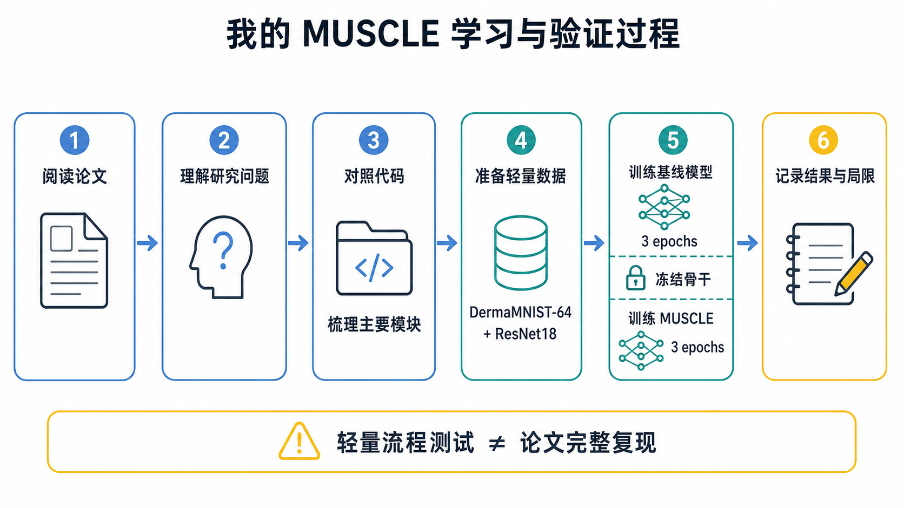
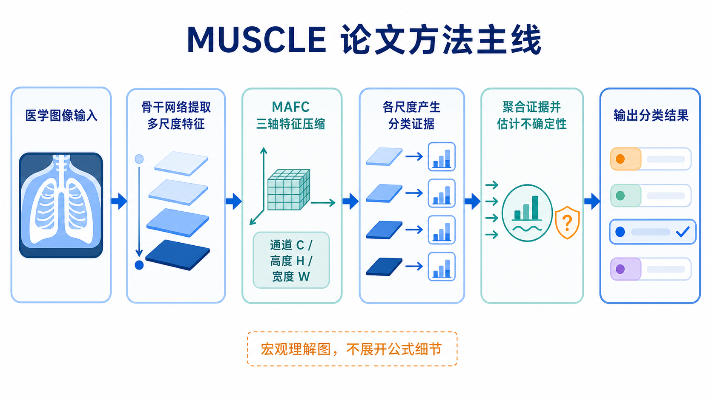

# MUSCLE：论文阅读与轻量实验记录

本仓库 fork 自 [Q4CS/MUSCLE](https://github.com/Q4CS/MUSCLE)，对应论文 *MUSCLE: A New Perspective to Multi-Scale Fusion for Medical Image Classification Based on the Theory of Evidence*。原作者的核心代码没有改动。本 fork 补充了三份中文整理，并用 DermaMNIST-64 和 ResNet18 做了一次小规模两阶段流程测试。这项测试只用于确认主要代码环节能够运行，不代表复现了论文实验结果。

## 方法概述

我目前对这篇论文的理解是：医学图像中的病变大小和分布可能不同，只使用网络最后一层的特征容易漏掉一部分局部信息。MUSCLE 从骨干网络的多个阶段提取特征，通过 Multi-Axis Feature Compression（MAFC）分别处理通道、高度和宽度方向的信息，再让不同尺度产生分类 evidence 并进行聚合。这里的 evidence 是模型对各类别给出的支持量，不是医学上的临床证据。

论文采用两阶段训练：先训练普通骨干网络，再加载这份参数并冻结骨干，只训练 MUSCLE 新增的多尺度模块。原始代码包含 ResNet、VanillaNet 和 Swin Transformer 三类骨干网络。

## 仓库内容

| 路径 | 内容 | 来源 |
|---|---|---|
| `datasets/` | 五套医学图像数据集的读取与增强 | 原作者 |
| `networks/` | 骨干网络及其 MUSCLE 版本 | 原作者 |
| `losses/` | 证据分类损失与尺度一致性损失 | 原作者 |
| `main.py` | 训练、验证和测试入口 | 原作者 |
| [`docs/代码结构.md`](docs/代码结构.md) | 代码模块与调用关系 | 本 fork 新增 |
| [`docs/论文方法与代码对应.md`](docs/论文方法与代码对应.md) | 论文概念在代码中的位置 | 本 fork 新增 |
| [`docs/实验范围与设置.md`](docs/实验范围与设置.md) | 论文设置与轻量实验的差异 | 本 fork 新增 |
| [`experiments/dermamnist_resnet18/`](experiments/dermamnist_resnet18/README.md) | DermaMNIST-64 + ResNet18 实验代码与记录 | 本 fork 新增 |

## 原始代码与数据

原作者给出的主要环境是 Python 3.10、PyTorch 2.0.1+cu117 和 NumPy 1.26.4。原始 `main.py` 面向 Linux 和 CUDA 环境，数据路径也需要按实际存放位置修改。本 fork 的轻量测试另写了一个 Windows CPU 入口，没有改动原始训练程序。

论文使用的五套数据集需要从各自的官方网站下载：[ISIC 2018](https://challenge.isic-archive.com/landing/2018/)、[APTOS 2019](https://www.kaggle.com/competitions/aptos2019-blindness-detection)、[KvasirV2](https://datasets.simula.no/kvasir)、[Chaoyang](https://bupt-ai-cz.github.io/HSA-NRL) 和 [CheXpert](https://stanfordmlgroup.github.io/competitions/chexpert)。数据集、预训练权重、checkpoint 和论文 PDF 均未上传至本仓库。

## 轻量实验结果

轻量实验采用固定随机种子，从 DermaMNIST-64 中抽取 224 个训练样本、70 个验证样本和 140 个测试样本，在 CPU 上分别训练 ResNet18 baseline 与冻结骨干的 MUSCLE 各 3 个 epoch。实验验证了 checkpoint 加载、骨干冻结、四尺度非负 evidence 以及融合模块参数更新。

| 模型 | Accuracy | Macro-F1 |
|---|---:|---:|
| ResNet18 baseline | 0.6500 | 0.1665 |
| ResNet18 + MUSCLE | 0.6714 | 0.1148 |

MUSCLE 在该设置下将测试样本全部预测为多数类。Accuracy 的小幅上升来自类别分布，而 Macro-F1 下降。因此，这组结果只说明两阶段代码链路可以运行，不能作为模型性能提升或论文结果复现的依据。完整记录见 [`RESULTS.md`](experiments/dermamnist_resnet18/RESULTS.md)。

## 论文引用

> Qiu, J., Cao, J., Huang, Y., et al. MUSCLE: A New Perspective to Multi-Scale Fusion for Medical Image Classification Based on the Theory of Evidence. *IEEE Transactions on Medical Imaging*, 45(3), 893–905, 2026. [https://doi.org/10.1109/TMI.2025.3612188](https://doi.org/10.1109/TMI.2025.3612188)
